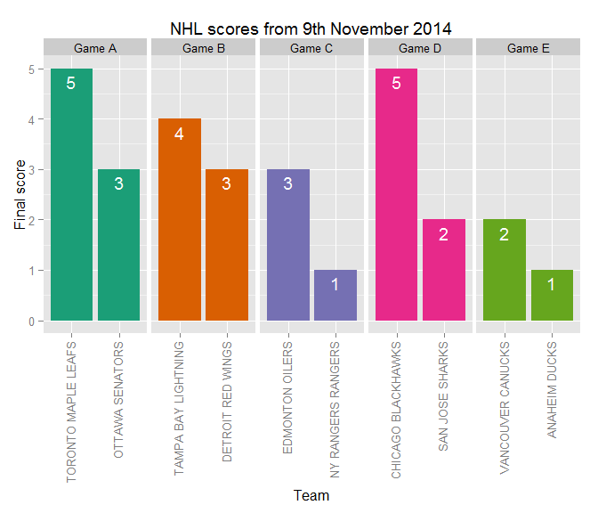

Introduction to gameday
-----------------------

When living in Canada, you must:

-   Live hockey;
-   Breathe hockey;
-   Think about hockey all the time;

Or:

-   Be banished from civilization and inevitably perish in the tundra.

The `gameday` package helps you to:

-   Prevent your banishment by providing basic National Hockey League
    information from live.nhle.com so you can masquerade as a hockey
    lover.

The `gameday` package has two functions:

1.  `gday()`
2.  `scores()`

Check gameday of a team with `gday()`
-------------------------------------

The function `gday()` returns TRUE if a specified NHL team plays on a
specified date and FALSE otherwise. The first argument is the name of an
NHL team (as a chracter string, i.e. team name in quotes), and the
second argument is the date of the game, as "YYYY-MM-DD".

For example, to check if the Toronto Maple Leafs played on 9th November
2014 using `gday()`:

    gday(team = "Maple Leafs", date = "2014-11-09")

Or simply:

    gday("Maple Leafs", "2014-11-09")

    ## [1] TRUE

If no arguments are specified in `gday()`, the default `team` is
"Canucks" and the default `date` is today's date. Also note, the case in
argument `team` is ignored. Thus the following queries are equivalent:

    gday()
    gday("canucks")
    gday("Canucks")
    gday("CANUCKS")

Check NHL game scores with `scores()`
-------------------------------------

The function `scores()` returns all the NHL game scores from a specified
date. `scores()` takes one argument, a date represented as "YYYY-MM-DD".
When there is at least one game on the date specified, the output of
`scores()` is a dataframe with four variable columns:

1.  `home`: team common name
2.  `away`: away team common name
3.  `home_score`: home team score
4.  `away_score`: away team score
5.  `game_status`: game status? 1 = scheduled, 3 = in progress, 5 =
    finished

For example, to see the result of all NHL hockey games on 9th November
2014:

    scores(date = "2014-11-09")

Or simply:

    scores("2014-11-09")

    ##                 home                away home_score away_score game_status
    ## 1    OTTAWA SENATORS TORONTO MAPLE LEAFS          3          5           5
    ## 2  DETROIT RED WINGS TAMPA BAY LIGHTNING          3          4           5
    ## 3 NY RANGERS RANGERS     EDMONTON OILERS          1          3           5
    ## 4 CHICAGO BLACKHAWKS     SAN JOSE SHARKS          5          2           5
    ## 5      ANAHEIM DUCKS   VANCOUVER CANUCKS          1          2           5

It is also possible to save the dataframe output to a variable, and
perform some data manipulations using `tidyr`, `plyr` and `dplyr` to put
the data into tall format:

    library("tidyr")
    library("plyr")
    library("dplyr")
    library("RColorBrewer")
    library("ggplot2")

    scores_2014_11_09 <- scores("2014-11-09")

    # Add a new column for game number
    scores_2014_11_09 <- 
        mutate(scores_2014_11_09, game_number = as.factor(c(paste("Game", LETTERS[1:nrow(scores_2014_11_09)]))))

    # Save home team, home score and game number
    scores_2014_11_09_home <- scores_2014_11_09 %>%
        select(home, home_score, game_number) %>%
        plyr::rename(c("home" = "team_name", "home_score" = "score"))

    # Save away team, away score and game number
    scores_2014_11_09_away <- scores_2014_11_09 %>%
        select(away, away_score, game_number) %>%
        plyr::rename(c("away" = "team_name", "away_score" = "score"))

    # Row bind scores_2014_11_09_home and scores_2014_11_09_away
    scores_2014_11_09_tall <- rbind(scores_2014_11_09_home, scores_2014_11_09_away)
    str(scores_2014_11_09_tall)

    ## 'data.frame':    10 obs. of  3 variables:
    ##  $ team_name  : Factor w/ 10 levels "ANAHEIM DUCKS",..: 5 3 4 2 1 9 8 6 7 10
    ##  $ score      : int  3 3 1 5 1 5 4 3 2 2
    ##  $ game_number: Factor w/ 5 levels "Game A","Game B",..: 1 2 3 4 5 1 2 3 4 5

    (arrange(scores_2014_11_09_tall, game_number))

    ##              team_name score game_number
    ## 1      OTTAWA SENATORS     3      Game A
    ## 2  TORONTO MAPLE LEAFS     5      Game A
    ## 3    DETROIT RED WINGS     3      Game B
    ## 4  TAMPA BAY LIGHTNING     4      Game B
    ## 5   NY RANGERS RANGERS     1      Game C
    ## 6      EDMONTON OILERS     3      Game C
    ## 7   CHICAGO BLACKHAWKS     5      Game D
    ## 8      SAN JOSE SHARKS     2      Game D
    ## 9        ANAHEIM DUCKS     1      Game E
    ## 10   VANCOUVER CANUCKS     2      Game E

Now the data is in tall format, we can plot the results from each game
using `ggplot2`:

    colour_pal <- brewer.pal(n = 5, name = "Dark2")
    scores_2014_11_09_tall %>%
        ggplot(aes(x = reorder(team_name, desc(score)), y = score, 
                             fill = game_number)) +         
        geom_bar(stat = "identity") +
        facet_wrap(~ game_number, scales = "free_x", ncol = 5) +
        theme(axis.text.x = element_text(angle = 90, hjust = 1, vjust = 0.3)) +
        ggtitle("NHL scores from 9th November 2014") +
        ylab("Final score") +
        xlab("Team") +
        theme(legend.position = "none") +
        geom_text(aes(label = score), vjust = 1.5, colour = "white") +
        scale_fill_manual(values = colour_pal)

